# **General Description**

The MAX30102 is an integrated pulse oximetry and heart-rate monitor module. It includes internal LEDs, photodetectors, optical elements, and low-noise electronics with ambient light rejection. The MAX30102 provides a complete system solution to ease the design-in process for mobile and wearable devices.

The MAX30102 operates on a single 1.8V power supply and a separate 3.3V power supply for the internal LEDs. Communication is through a standard I2C-compatible interface. The module can be shut down through software with zero standby current, allowing the power rails to remain powered at all times.

# **Applications**

- Wearable Devices
- Fitness Assistant Devices
- Smartphones
- Tablets

# **Benefits and Features**

- Heart-Rate Monitor and Pulse Oximeter Sensor in LED Reflective Solution
- Tiny 5.6mm x 3.3mm x 1.55mm 14-Pin Optical Module
  - Integrated Cover Glass for Optimal, Robust Performance
- Ultra-Low Power Operation for Mobile Devices
  - Programmable Sample Rate and LED Current for Power Savings
  - Low-Power Heart-Rate Monitor (< 1mW)
  - Ultra-Low Shutdown Current (0.7µA, typ)
- Fast Data Output Capability
  - High Sample Rates
- Robust Motion Artifact Resilience
  - High SNR
- -40°C to +85°C Operating Temperature Range

### *[Ordering Information](#page-30-0) appears at end of data sheet.*

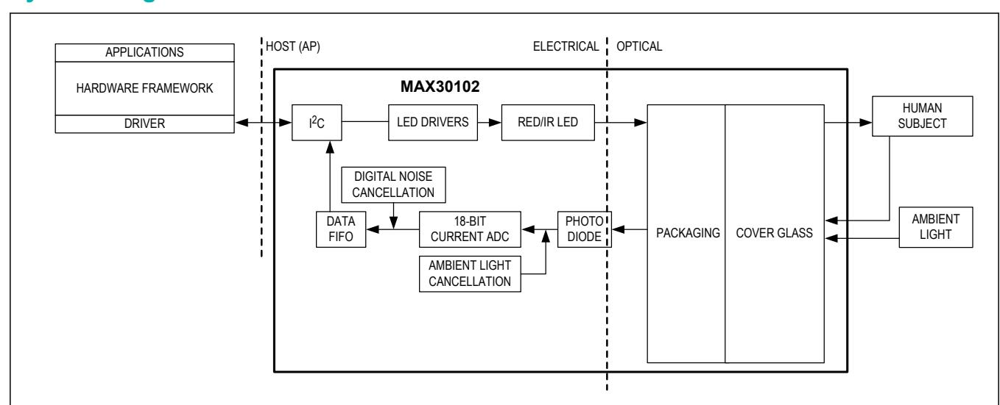

# **MAX30102 High-Sensitivity Pulse Oximeter and Heart-Rate Sensor for Wearable Health**

## **System Diagram**

| VDD to GND .........................................................-0.3V to +2.2V |                                                                       |
|------------------------------------------------------------------------------------|-----------------------------------------------------------------------|
| All Other Pins to GND                                                              | ..........................................-0.3V to +6.0V              |
| Continuous Input Current into Any Terminal                                         | ....................±20mA                                             |
| Latchup Immunity                                                                   | ...........................................................±250mA     |
|                                                                                    | OESIP (derate 5.5mW/°C above +70°C) ....................440mW         |
|                                                                                    | Storage Temperature Range............................ -40°C to +105°C |

| PARAMETER POWER SUPPLY     | SYMBOL | CONDITIONS Guaranteed by RED and IR count                      | MIN | TYP | MAX  | UNITS |
|----------------------------|--------|----------------------------------------------------------------|-----|-----|------|-------|
| Power-Supply Voltage       | VDD    |                                                                |     |     |      |       |
| LED Supply Voltage         |        | tolerance                                                      | 1.7 | 1.8 | 2.0  | V     |
| VLED+ to PGND              | VLED+  | Guaranteed by PSRR of LED driver SpO2 and HR mode, PW = 215µs, | 3.1 | 3.3 | 5.0  | V     |
| Supply Current             | IDD    |                                                                |     |     |      |       |
|                            |        | 50sps                                                          |     | 600 | 1200 | µA    |
|                            |        | IR only mode, PW = 215µS, 50sps                                |     | 600 | 1200 |       |
| Supply Current in Shutdown | ISHDN  | TA = +25°C, MODE = 0x80                                        |     | 0.7 | 10   | µA    |

# MAX30102 High-Sensitivity Pulse Oximeter and Heart-Rate Sensor for Wearable Health

Package thermal resistances were obtained using the method described in JEDEC specification JESD51-7, using a four-layer board. For detailed information on package thermal considerations, refer to **[www.maximintegrated.com/thermal-tutorial](http://www.maximintegrated.com/thermal-tutorial)**.

*Stresses beyond those listed under "Absolute Maximum Ratings" may cause permanent damage to the device. These are stress ratings only; functional operation of the device at these or any other conditions beyond those indicated in the operational sections of the specifications is not implied. Exposure to absolute maximum rating conditions for extended periods may affect device reliability.*

# **Absolute Maximum Ratings**

# **Electrical Characteristics**

For the latest package outline information and land patterns (footprints), go to **[www.maximintegrated.com/packages](http://www.maximintegrated.com/packages)**. Note that a "+", "#", or "-" in the package code indicates RoHS status only. Package drawings may show a different suffix character, but the drawing pertains to the package regardless of RoHS status.

# **Package Information**

| PACKAGE TYPE: 14 OESIP                                   |            |
|----------------------------------------------------------|------------|
| Package Code                                             | F143A5MK+1 |
| Outline Number                                           | 21-1048    |
| Land Pattern Number THERMAL RESISTANCE, FOUR-LAYER BOARD | 90-0602    |
| Junction to Ambient (θ JA)                               | 180°C/W    |
| Junction to Case (θ JC)                                  | 150°C/W    |

| PARAMETER ADC Resolution Red ADC Count (Note 2) IR ADC Count (Note 2) | SYMBOL REDC IRC | CONDITIONS LED1_PA = 0x0C, LED_PW = 0x01, SPO2_SR = 0x05, ADC_RGE = 0x00 LED2_PA = 0x0C, LED_PW = 0x01, SPO2_SR = 0x05 ADC_RGE = 0x00 | MIN   | TYP 18 65536 65536 | MAX   | UNITS bits Counts Counts |
|-----------------------------------------------------------------------|-----------------|---------------------------------------------------------------------------------------------------------------------------------------|-------|--------------------|-------|--------------------------|
| Dark Current Count                                                    | LED_DCC         |                                                                                                                                       |       |                    |       |                          |
|                                                                       |                 | LED1_PA = LED2_PA = 0x00, LED_PW = 0x03, SPO2_SR = 0x01                                                                               |       | 30                 | 128   | Counts                   |
|                                                                       |                 | ADC_RGE = 0x02 ADC counts with finger on Red                                                                                          |       | 0.01               | 0.05  | % of FS                  |
| DC Ambient Light Rejection                                            | ALR             |                                                                                                                                       |       |                    |       |                          |
|                                                                       |                 | LED sensor under direct sunlight (100K lux), ADC_RGE = 0x3, LED_PW = 0x03, IR                                                         |       | 2                  |       | Counts                   |
|                                                                       |                 | LED SPO2_SR = 0x01 1.7V < VDD < 2.0V,                                                                                                 |       | 2                  |       | Counts                   |
| ADC Count—PSRR (VDD)                                                  | PSRRVDD         |                                                                                                                                       |       |                    |       |                          |
|                                                                       |                 | LED_PW = 0x01, SPO2_SR = 0x05                                                                                                         |       | 0.25               | 1     | % of FS                  |
|                                                                       |                 | Frequency = DC to 100kHz, 100mVP-P 3.1V < VLED+, < 5.0V, LED1_PA =                                                                    |       | 10                 |       | LSB                      |
| (LED Driver Outputs)                                                  | PSRRLED         |                                                                                                                                       |       |                    |       |                          |
| ADC Count—PSRR                                                        |                 | LED2_PA = 0x0C, LED_PW = 0x01, SPO2_SR = 0x05                                                                                         |       | 0.05               | 1     | % of FS                  |
|                                                                       |                 | Frequency = DC to 100kHz, 100mVP-P                                                                                                    |       | 10                 |       | LSB                      |
| ADC Clock Frequency                                                   | CLK             |                                                                                                                                       | 10.32 | 10.48              | 10.64 | MHz                      |
| ADC Integration Time                                                  | INT             |                                                                                                                                       |       |                    |       |                          |
|                                                                       |                 | LED_PW = 0x00                                                                                                                         |       | 69                 |       |                          |
|                                                                       |                 | LED_PW = 0x01                                                                                                                         |       | 118                |       | µs                       |
|                                                                       |                 | LED_PW = 0x02                                                                                                                         |       | 215                |       |                          |
|                                                                       |                 | LED_PW = 0x03                                                                                                                         |       | 411                |       |                          |
| Slot Timing (Timing Between                                           |                 | LED_PW = 0x00                                                                                                                         |       | 427.1              |       |                          |
| Sequential Channel Samples; e.g., Red Pulse Rising Edge To            | INT             | LED_PW = 0x01                                                                                                                         |       | 524.7              |       | µs                       |
| IR Pulse Rising Edge)                                                 |                 | LED_PW = 0x02                                                                                                                         |       | 720.0              |       |                          |
|                                                                       |                 | LED_PW = 0x03                                                                                                                         |       | 1106.6             |       |                          |
| Hydrolytic Resistance Class                                           |                 | Per DIN ISO 719                                                                                                                       |       | HGB 1              |       |                          |

# MAX30102 High-Sensitivity Pulse Oximeter and Heart-Rate Sensor for Wearable Health

# **Electrical Characteristics (continued)**

| PARAMETER                            | SYMBOL     | CONDITIONS                | MIN TYP MAX | UNITS |
|--------------------------------------|------------|---------------------------|-------------|-------|
| LED Peak Wavelength                  | λ P        | ILED = 20mA, TA = +25°C   | 870 880 900 | nm    |
| Full Width at Half Max               | Δλ         | ILED = 20mA, TA = +25°C   | 30          | nm    |
| Forward Voltage                      | VF         | ILED = 20mA, TA = +25°C   | 1.4         | V     |
| Radiant Power                        | PO         | ILED = 20mA, TA = +25°C   | 6.5         | mW    |
| LED Peak Wavelength                  | λ P        | ILED = 20mA, TA = +25°C   | 650 660 670 | nm    |
| Full Width at Half Max               | Δλ         | ILED = 20mA, TA = +25°C   | 20          | nm    |
| Forward Voltage                      | VF         | ILED = 20mA, TA = +25°C   | 2.1         | V     |
| Radiant Power                        | PO         | ILED = 20mA, TA = +25°C   | 9.8         | mW    |
| Spectral Range of Sensitivity        | λ          |                           |             |       |
|                                      | (QE > 50%) | QE: Quantum Efficiency    | 600 900     | nm    |
| Radiant Sensitive Area               | A          |                           | 1.36        | mm2   |
| Area                                 | L x W      |                           | 1.38 x      |       |
| Time                                 | TT         | TA = +25°C                | 29          | ms    |
| Temperature Sensor Accuracy          | TA         | TA = +25°C                | ± 1         | °C    |
| Range                                | TMIN       |                           | -40         | °C    |
| Range                                | TMAX       |                           | 85          | °C    |
| Input High Voltage                   | VIH        | VDD = 2V                  | 0.7 x       |       |
| Input Low Voltage                    | VIL        | VDD = 2V                  | 0.3 x       |       |
| Hysteresis Voltage                   | VH         |                           | 0.2         | V     |
| Input Leakage Current                | IIN        | VIN = GND or VDD (STATIC) | ± 0.05 ±    | 1 µA  |
| DIGITAL OUTPUT CHARACTERISTICS: SDA, |            | INT                       |             |       |
| Ouput Low Voltage                    | VOL        | ISINK = 6mA               | 0.2         | V     |

# MAX30102 High-Sensitivity Pulse Oximeter and Heart-Rate Sensor for Wearable Health

# **Electrical Characteristics (continued)**

**Note 1:** All devices are 100% production tested at TA = +25°C. Specifications over temperature limits are guaranteed by Maxim Integrated's bench or proprietary automated test equipment (ATE) characterization.

**Note 2:** Specifications are guaranteed by Maxim Integrated's bench characterization and by 100% production test using proprietary ATE setup and conditions.

**Note 3:** Guaranteed by design and characterization. Not tested in final production.

| PARAMETER                     | SYMBOL                                               | CONDITIONS MIN TYP | MAX UNITS |
|-------------------------------|------------------------------------------------------|--------------------|-----------|
|                               | I2C TIMING CHARACTERISTICS (SDA, SDA, INT ) (Note 3) |                    |           |
| I2C Write Address             |                                                      | AE                 | Hex       |
| I2C Read Address              |                                                      | AF                 | Hex       |
| Serial Clock Frequency        | fSCL                                                 | 0                  | 400 kHz   |
| and START Conditions          | tBUF                                                 | 1.3                | µs        |
| Condition                     | tHD;STA                                              | 0.6                | µs        |
| SCL Pulse-Width Low           | tLOW                                                 | 1.3                | µs        |
| SCL Pulse-Width High          | tHIGH                                                | 0.6                | µs        |
| START Condition               | tSU;STA                                              | 0.6                | µs        |
| Data Hold Time                | tHD;DAT                                              | 0                  | 900 ns    |
| Data Setup Time               | tSU;DAT                                              | 100                | ns        |
| Setup Time for STOP Condition | tSU;STO                                              | 0.6                | µs        |
| Spike                         | tSP                                                  | 0                  | 50 ns     |
| Bus Capacitance               | CB                                                   |                    | 400 pF    |
| Time                          | tR                                                   | 20 + 0.1CB         | 300 ns    |
| Time                          | tRF                                                  | 20 + 0.1CB         | 300 ns    |
| SDA Transmitting Fall Time    | tTF                                                  |                    | 300 ns    |

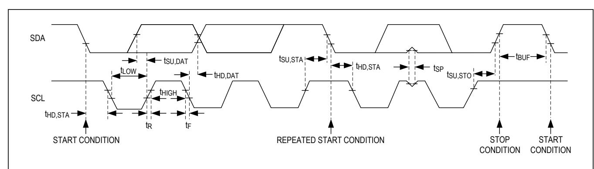

# MAX30102 High-Sensitivity Pulse Oximeter and Heart-Rate Sensor for Wearable Health

# **Electrical Characteristics (continued)**

(VDD = 1.8V, VLED+ = 5.0V, TA = +25°C, RST, unless otherwise noted.)

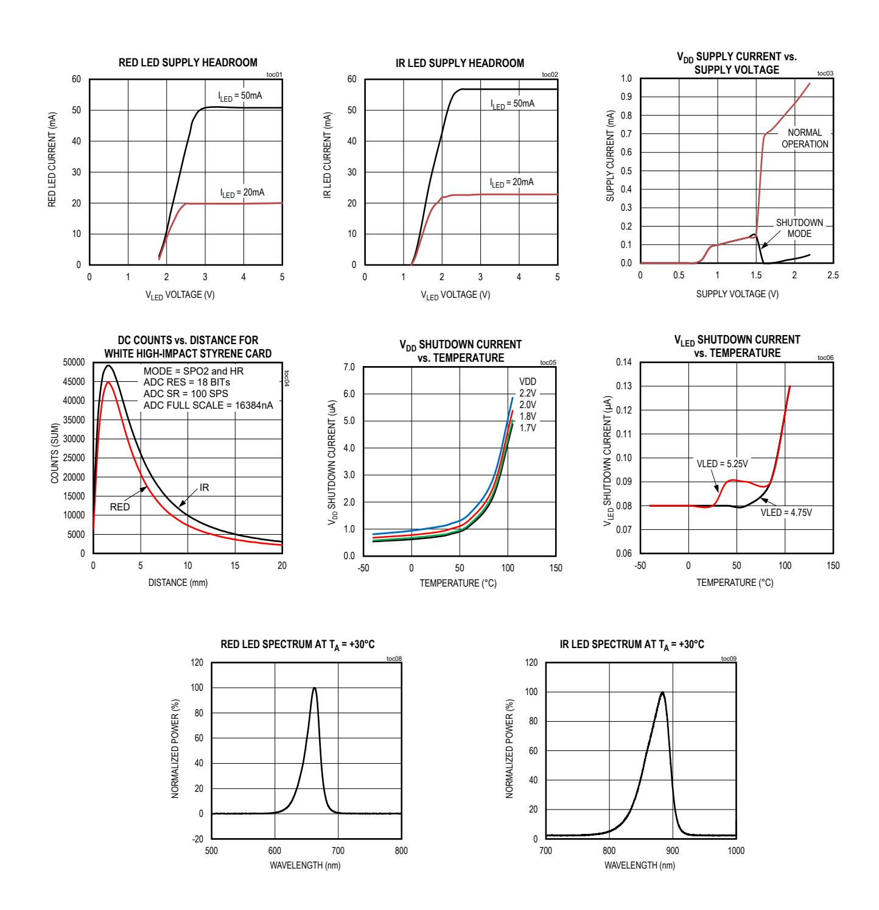

# **Typical Operating Characteristics**

(VDD = 1.8V, VLED+ = 5.0V, TA = +25°C, RST, unless otherwise noted.)

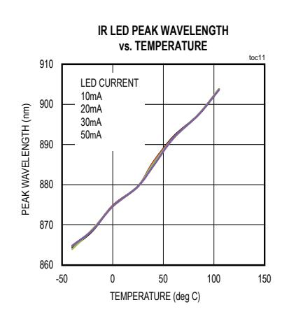

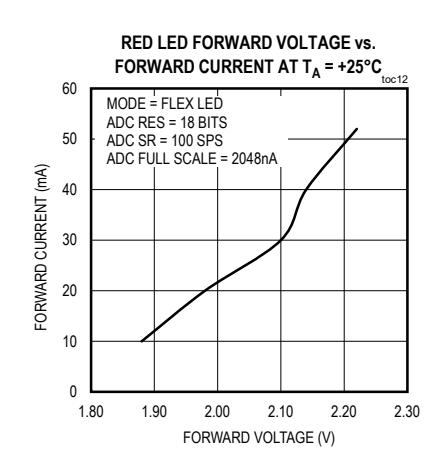

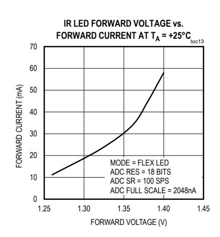

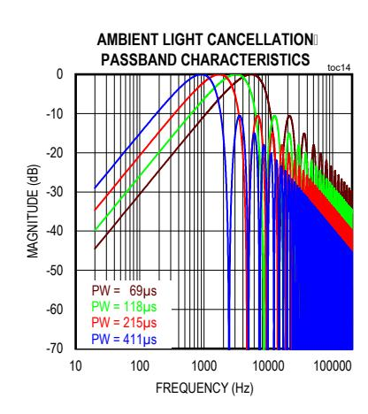

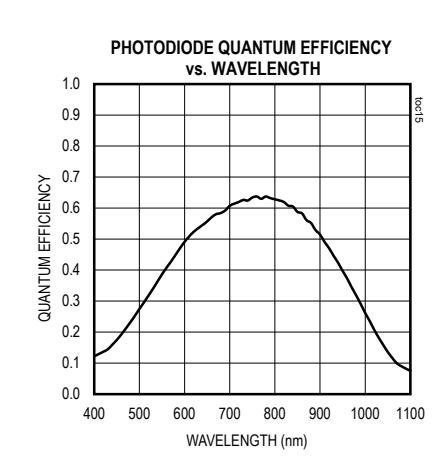

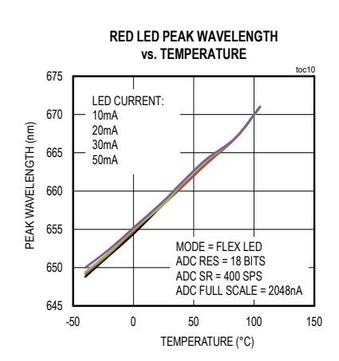

# **Typical Operating Characteristics (continued)**

| PIN      | NAME  | FUNCTION                                                                                  |
|----------|-------|-------------------------------------------------------------------------------------------|
| 7, 8, 14 | N.C.  | No Connection. Connect to PCB pad for mechanical stability.                               |
| 2        | SCL   | I2C Clock Input                                                                           |
| 3        | SDA   | I2C Data, Bidirectional (Open-Drain)                                                      |
| 4        | PGND  | Power Ground of the LED Driver Blocks                                                     |
| 9        | VLED+ | LED Power Supply (anode connection). Use a bypass capacitor to PGND for best              |
| 10       | VLED+ | performance.                                                                              |
| 11       | VDD   | Analog Power Supply Input. Use a bypass capacitor to GND for best performance.            |
| 12       | GND   | Analog Ground                                                                             |
| 13       | INT   | Active-Low Interrupt (Open-Drain). Connect to an external voltage with a pullup resistor. |

| N.C. | 1 |    |       |
|------|---|----|-------|
| SCL  | 2 |    |       |
| SDA  | 3 |    |       |
| PGND | 4 |    |       |
| N.C. | 5 |    |       |
| N.C. | 6 |    |       |
| N.C. | 7 |    |       |
|      |   | 14 | N.C.  |
|      |   | 13 | INT   |
|      |   | 12 | GND   |
|      |   | 11 | VDD   |
|      |   | 10 | VLED+ |
|      |   | 9  | VLED+ |
|      |   | 8  | N.C.  |

## **Pin Description**

# **Pin Configuration**

## **Detailed Description**

The MAX30102 is a complete pulse oximetry and heart-rate sensor system solution module designed for the demanding requirements of wearable devices. The device maintains a very small solution size without sacrificing optical or electrical performance. Minimal external hardware components are required for integration into a wearable system.

The MAX30102 is fully adjustable through software registers, and the digital output data can be stored in a 32-deep FIFO within the IC. The FIFO allows the MAX30102 to be connected to a microcontroller or processor on a shared bus, where the data is not being read continuously from the MAX30102's registers.

# **SpO2 Subsystem**

The SpO2 subsystem of the MAX30102 contains ambient light cancellation (ALC), a continuous-time sigma-delta ADC, and a proprietary discrete time filter. The ALC has an internal Track/Hold circuit to cancel ambient light and increase the effective dynamic range. The SpO2 ADC has programmable full-scale ranges from 2µA to 16µA. The ALC can cancel up to 200µA of ambient current.

The internal ADC is a continuous time oversampling sigma-delta converter with 18-bit resolution. The ADC sampling rate is 10.24MHz. The ADC output data rate can be programmed from 50sps (samples per second) to 3200sps.

### **Temperature Sensor**

The MAX30102 has an on-chip temperature sensor for calibrating the temperature dependence of the SpO2 subsystem. The temperature sensor has an inherent resolution of 0.0625°C.

The device output data is relatively insensitive to the wavelength of the IR LED, where the Red LED's wavelength is critical to correct interpretation of the data. An SpO2 algorithm used with the MAX30102 output signal can compensate for the associated SpO2 error with ambient temperature changes.

### **LED Driver**

The MAX30102 integrates Red and IR LED drivers to modulate LED pulses for SpO2 and HR measurements. The LED current can be programmed from 0 to 50mA with proper supply voltage. The LED pulse width can be programmed from 69µs to 411µs to allow the algorithm to optimize SpO2 and HR accuracy and power consumption based on use cases.

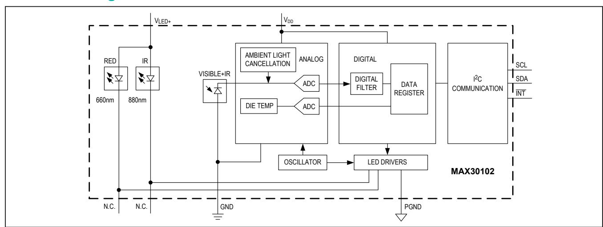

# **Functional Diagram**

# **Register Maps and Descriptions**

| REGISTER      | B7 B6 B5     | B4 B3 B2 B1 B0           | REG  |       |     |
|---------------|--------------|--------------------------|------|-------|-----|
|               |              |                          |      | STATE | R/W |
| Status 1      | A_FULL PPG_  |                          |      |       |     |
|               |              | RDY                      | 0x00 | 0X00  | R   |
|               |              | _RDY                     | 0x01 | 0x00  | R   |
|               | OVF_EN       |                          | 0x02 | 0X00  | R/W |
|               |              | _RDY_EN                  | 0x03 | 0x00  | R/W |
| Pointer       |              | FIFO_WR_PTR[4:0]         | 0x04 | 0x00  | R/W |
| Counter       |              | OVF_COUNTER[4:0]         | 0x05 | 0x00  | R/W |
| Pointer       |              | FIFO_RD_PTR[4:0]         | 0x06 | 0x00  | R/W |
| Register      |              | FIFO_DATA[7:0]           | 0x07 | 0x00  | R/W |
| Configuration | SMP_AVE[2:0] |                          |      |       |     |
|               |              | FIFO_A_FULL[3:0]         | 0x08 | 0x00  | R/W |
| Configuration | SHDN RESET   | MODE[2:0]                | 0x09 | 0x00  | R/W |
|               | [1:0]        | SPO2_SR[2:0] LED_PW[1:0] | 0x0A | 0x00  | R/W |
| RESERVED      |              |                          | 0x0B | 0x00  | R/W |
|               |              | LED1_PA[7:0]             | 0x0C | 0x00  | R/W |
|               |              | LED2_PA[7:0]             | 0x0D | 0x00  | R/W |
| RESERVED      |              |                          | 0x0E | 0x00  | R/W |
| RESERVED      |              |                          | 0x0F | 0x00  | R/W |
|               | SLOT2[2:0]   | SLOT1[2:0]               | 0x11 | 0x00  | R/W |
|               | SLOT4[2:0]   | SLOT3[2:0]               | 0x12 | 0x00  | R/W |

\**XX denotes a 2-digit hexadecimal number (00 to FF) for part revision identification. Contact Maxim Integrated for the revision ID number assigned for your product.*

# **Register Maps and Descriptions (continued)**

| REGISTER B7 | B6 B5 B4 B3 | B2         | B1 B0 | REG   |       |     |
|-------------|-------------|------------|-------|-------|-------|-----|
|             |             |            |       |       | STATE | R/W |
| RESERVED    |             |            |       | 0x13– |       |     |
|             |             |            |       | 0x17  | 0xFF  | R/W |
| RESERVED    |             |            |       | 0x18- |       |     |
|             |             |            |       | 0x1E  | 0x00  | R   |
| Integer     | TINT[7:0]   |            |       | 0x1F  | 0x00  | R   |
| Fraction    |             | TFRAC[3:0] |       | 0x20  | 0x00  | R   |
|             |             |            | _EN   | 0x21  | 0x00  | R/W |
| RESERVED    |             |            |       | 0x22– |       |     |
|             |             |            |       | 0x2F  | 0x00  | R/W |
| Revision ID | REV_ID[7:0] |            |       | 0xFE  | 0xXX* | R   |
| Part ID     | PART_ID[7]  |            |       | 0xFF  | 0x15  | R   |

Whenever an interrupt is triggered, the MAX30102 pulls the active-low interrupt pin into its low state until the interrupt is cleared.

### **A\_FULL: FIFO Almost Full Flag**

In SpO2 and HR modes, this interrupt triggers when the FIFO write pointer has a certain number of free spaces remaining. The trigger number can be set by the FIFO\_A\_FULL[3:0] register. The interrupt is cleared by reading the Interrupt Status 1 register (0x00).

### **PPG\_RDY: New FIFO Data Ready**

In SpO2 and HR modes, this interrupt triggers when there is a new sample in the data FIFO. The interrupt is cleared by reading the Interrupt Status 1 register (0x00), or by reading the FIFO\_DATA register.

### **ALC\_OVF: Ambient Light Cancellation Overflow**

This interrupt triggers when the ambient light cancellation function of the SpO2/HR photodiode has reached its maximum limit, and therefore, ambient light is affecting the output of the ADC. The interrupt is cleared by reading the Interrupt Status 1 register (0x00).

### **PWR\_RDY: Power Ready Flag**

On power-up or after a brownout condition, when the supply voltage VDD transitions from below the undervoltage lockout (UVLO) voltage to above the UVLO voltage, a power-ready interrupt is triggered to signal that the module is powered-up and ready to collect data.

### **DIE\_TEMP\_RDY: Internal Temperature Ready Flag**

When an internal die temperature conversion is finished, this interrupt is triggered so the processor can read the temperature data registers. The interrupt is cleared by reading either the Interrupt Status 2 register (0x01) or the TFRAC register (0x20).

### **Interrupt Status (0x00–0x01)**

| REGISTER | B7     | B6      | B5      | B4 | B3 | B2 | B1       | B0   | REG  |       |     |
|----------|--------|---------|---------|----|----|----|----------|------|------|-------|-----|
|          |        |         |         |    |    |    |          |      |      | STATE | R/W |
| Status 1 | A_FULL | PPG_RDY | ALC_OVF |    |    |    |          | PWR_ |      |       |     |
|          |        |         |         |    |    |    |          | RDY  | 0x00 | 0X00  | R   |
|          |        |         |         |    |    |    | TEMP_RDY |      | 0x01 | 0x00  | R   |

The interrupts are cleared whenever the interrupt status register is read, or when the register that triggered the interrupt is read. For example, if the SpO2 sensor triggers an interrupt due to finishing a conversion, reading either the FIFO data register or the interrupt register clears the interrupt pin (which returns to its normal HIGH state). This also clears all the bits in the interrupt status register to zero.

### **Interrupt Enable (0x02-0x03)**

Each source of hardware interrupt, with the exception of power ready, can be disabled in a software register within the MAX30102 IC. The power-ready interrupt cannot be disabled because the digital state of the module is reset upon a brownout condition (low power supply voltage), and the default condition is that all the interrupts are disabled. Also, it is important for the system to know that a brownout condition has occurred, and the data within the module is reset as a result.

The unused bits should always be set to zero for normal operation.

### **FIFO (0x04–0x07)**

### **FIFO Write Pointer**

The FIFO Write Pointer points to the location where the MAX30102 writes the next sample. This pointer advances for each sample pushed on to the FIFO. It can also be changed through the I2C interface when MODE[2:0] is 010, 011, or 111.

### **FIFO Overflow Counter**

When the FIFO is full, samples are not pushed on to the FIFO, samples are lost. OVF\_COUNTER counts the number of samples lost. It saturates at 0x1F. When a complete sample is "popped" (i.e., removal of old FIFO data and shifting the samples down) from the FIFO (when the read pointer advances), OVF\_COUNTER is reset to zero.

### **FIFO Read Pointer**

The FIFO Read Pointer points to the location from where the processor gets the next sample from the FIFO through the I2C interface. This advances each time a sample is popped from the FIFO. The processor can also write to this pointer after reading the samples to allow rereading samples from the FIFO if there is a data communication error.

| REGISTER | B7 | B6 | B5     | B4 | B3 | B2 | B1     | B0 | REG  |       |     |
|----------|----|----|--------|----|----|----|--------|----|------|-------|-----|
|          |    |    |        |    |    |    |        |    |      | STATE | R/W |
|          |    |    | OVF_EN |    |    |    |        |    | 0x02 | 0X00  | R/W |
|          |    |    |        |    |    |    | RDY_EN |    | 0x03 | 0x00  | R/W |

| REGISTER B7 B6 | B5 B4 B3 B2 B1   | B0 REG |       |     |
|----------------|------------------|--------|-------|-----|
|                |                  |        | STATE | R/W |
| Pointer        | FIFO_WR_PTR[4:0] | 0x04   | 0x00  | R/W |
| Counter        | OVF_COUNTER[4:0] | 0x05   | 0x00  | R/W |
| Pointer        | FIFO_RD_PTR[4:0] | 0x06   | 0x00  | R/W |
| Register       | FIFO_DATA[7:0]   | 0x07   | 0x00  | R/W |

### **FIFO Data Register**

The circular FIFO depth is 32 and can hold up to 32 samples of data. The sample size depends on the number of LED channels (a.k.a. channels) configured as active. As each channel signal is stored as a 3-byte data signal, the FIFO width can be 3 bytes or 6 bytes in size.

The FIFO\_DATA register in the I2C register map points to the next sample to be read from the FIFO. FIFO\_RD\_PTR points to this sample. Reading FIFO\_DATA register, does not automatically increment the I2C register address. Burst reading this register, reads the same address over and over. Each sample is 3 bytes of data per channel (i.e., 3 bytes for RED, 3 bytes for IR, etc.).

The FIFO registers (0x04–0x07) can all be written and read, but in practice only the FIFO\_RD\_PTR register should be written to in operation. The others are automatically incremented or filled with data by the MAX30102. When starting a new SpO2 or heart rate conversion, it is recommended to first clear the FIFO\_WR\_PTR, OVF\_COUNTER, and FIFO\_RD\_PTR registers to all zeroes (0x00) to ensure the FIFO is empty and in a known state. When reading the MAX30102 registers in one burst-read I2C transaction, the register address pointer typically increments so that the next byte of data sent is from the next register, etc. The exception to this is the FIFO data register, register 0x07. When reading this register, the address pointer does not increment, but the FIFO\_RD\_PTR does. So the next byte of data sent represents the next byte of data available in the FIFO.

### **Reading from the FIFO**

Normally, reading registers from the I2C interface autoincrements the register address pointer, so that all the registers can be read in a burst read without an I2C start event. In the MAX30102, this holds true for all registers except for the FIFO\_DATA register (register 0x07).

Reading the FIFO\_DATA register does not automatically increment the register address. Burst reading this register reads data from the same address over and over. Each sample comprises multiple bytes of data, so multiple bytes should be read from this register (in the same transaction) to get one full sample.

The other exception is 0xFF. Reading more bytes after the 0xFF register does not advance the address pointer back to 0x00, and the data read is not meaningful.

### **FIFO Data Structure**

The data FIFO consists of a 32-sample memory bank that can store IR and Red ADC data. Since each sample consists of two channels of data, there are 6 bytes of data for each sample, and therefore 192 total bytes of data can be stored in the FIFO.

The FIFO data is left-justified as shown in [Table 1;](#page-13-0) in other words, the MSB bit is always in the bit 17 data position regardless of ADC resolution setting. See Table 2 for a visual presentation of the FIFO data structure.

**Table 1. FIFO Data is Left-Justified**

| FIFO _DATA[17] |               |
|----------------|---------------|
| FIFO _DATA[16] |               |
| FIFO _DATA[12] |               |
| FIFO _DATA[11] |               |
| FIFO _DATA[10] |               |
| FIFO _DATA[9]  |               |
| FIFO _DATA[8]  |               |
| FIFO           | _DATA[7]      |
|                | FIFO _DATA[6] |
|                | FIFO _DATA[5] |
|                | FIFO _DATA[4] |
|                | FIFO _DATA[3] |
|                | FIFO _DATA[2] |
|                | FIFO _DATA[1] |
|                | FIFO _DATA[0] |

### **FIFO Data Contains 3 Bytes per Channel**

The FIFO data is left-justified, meaning that the MSB is always in the same location regardless of the ADC resolution setting. FIFO DATA[18] – [23] are not used. Table 2 shows the structure of each triplet of bytes (containing the 18-bit ADC data output of each channel).

Each data sample in SpO2 mode comprises two data triplets (3 bytes each), To read one sample, requires an I2C read command for each byte. Thus, to read one sample in SpO2 mode, requires 6 I2C byte reads. The FIFO read pointer is automatically incremented after the first byte of each sample is read.

### **Write/Read Pointers**

Write/Read pointers are used to control the flow of data in the FIFO. The write pointer increments every time a new sample is added to the FIFO. The read pointer is incremented every time a sample is read from the FIFO. To reread a sample from the FIFO, decrement its value by one and read the data register again.

The FIFO write/read pointers should be cleared (back to 0x00) upon entering SpO2 mode or HR mode, so that there is no old data represented in the FIFO. The pointers are automatically cleared if VDD is power-cycled or VDD drops below its UVLO voltage.

| BYTE 1 | FIFO_ |
|--------|-------|
| BYTE 2 | FIFO_ |
| BYTE 3 | FIFO_ |

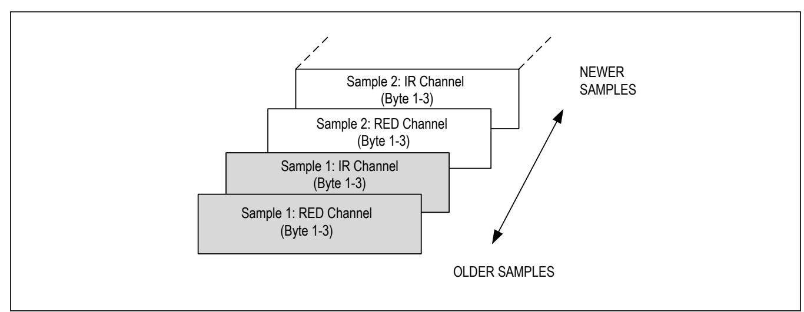

Third transaction: Write to FIFO\_RD\_PTR register. If the second transaction was successful, FIFO\_RD\_PTR points to the next sample in the FIFO, and this third transaction is not necessary. Otherwise, the processor updates the FIFO\_RD\_PTR appropriately, so that the samples are reread.

### **FIFO Configuration (0x08)**

### **Bits 7:5: Sample Averaging (SMP\_AVE)**

To reduce the amount of data throughput, adjacent samples (in each individual channel) can be averaged and decimated on the chip by setting this register.

### **Bit 4: FIFO Rolls on Full (FIFO\_ROLLOVER\_EN)**

This bit controls the behavior of the FIFO when the FIFO becomes completely filled with data. If FIFO\_ROLLOVER\_EN is set (1), the FIFO address rolls over to zero and the FIFO continues to fill with new data. If the bit is not set (0), then the FIFO is not updated until FIFO\_DATA is read or the WRITE/READ pointer positions are changed.

### **Bits 3:0: FIFO Almost Full Value (FIFO\_A\_FULL)**

This register sets the number of data samples (3 bytes/sample) remaining in the FIFO when the interrupt is issued. For example, if this field is set to 0x0, the interrupt is issued when there is 0 data samples remaining in the FIFO (all 32 FIFO words have unread data). Furthermore, if this field is set to 0xF, the interrupt is issued when 15 data samples are remaining in the FIFO (17 FIFO data samples have unread data).

## **Table 3. Sample Averaging**

| REGISTER      | B7 | B6           | B5 | B4       | B3 | B2 B1            | B0 | REG  |       |     |
|---------------|----|--------------|----|----------|----|------------------|----|------|-------|-----|
|               |    |              |    |          |    |                  |    |      | STATE | R/W |
| Configuration |    | SMP_AVE[2:0] |    | FIFO_ROL |    |                  |    |      |       |     |
|               |    |              |    | LOVER_EN |    | FIFO_A_FULL[3:0] |    | 0x08 | 0x00  | R/W |

| SMP_AVE[2:0] 000 | NO. OF SAMPLES AVERAGED PER FIFO SAMPLE 1 (no averaging) |
|------------------|----------------------------------------------------------|
| 001              | 2                                                        |
| 010              | 4                                                        |
| 011              | 8                                                        |
| 100              | 16                                                       |
| 101              | 32                                                       |
| 110              | 32                                                       |
| 111              | 32                                                       |

| FIFO_A_FULL[3:0] | EMPTY DATA SAMPLES IN FIFO WHEN INTERRUPT IS ISSUED | UNREAD DATA SAMPLES IN FIFO WHEN INTERRUPT IS ISSUED |
|------------------|-----------------------------------------------------|------------------------------------------------------|
| 0x0h             | 0                                                   | 32                                                   |
| 0x1h             | 1                                                   | 31                                                   |
| 0x2h             | 2                                                   | 30                                                   |
| 0x3h             | 3                                                   | 29                                                   |
| 0xFh             | 15                                                  | 17                                                   |

### **Mode Configuration (0x09)**

### **Bits 6:5: SpO2 ADC Range Control**

This register sets the SpO2 sensor ADC's full-scale range as shown in [Table 5.](#page-17-0)

### **Bit 7: Shutdown Control (SHDN)**

The part can be put into a power-save mode by setting this bit to one. While in power-save mode, all registers retain their values, and write/read operations function as normal. All interrupts are cleared to zero in this mode.

### **Bit 6: Reset Control (RESET)**

When the RESET bit is set to one, all configuration, threshold, and data registers are reset to their power-on-state through a power-on reset. The RESET bit is cleared automatically back to zero after the reset sequence is completed.

**Note:** Setting the RESET bit does not trigger a PWR\_RDY interrupt event.

### **Bits 2:0: Mode Control**

These bits set the operating state of the MAX30102. Changing modes does not change any other setting, nor does it erase any previously stored data inside the data registers.

## **SpO2 Configuration (0x0A)**

## **Table 4. Mode Control**

# **Table 5. SpO2 ADC Range Control (18-Bit Resolution)**

| REGISTER      | B7   | B6    | B5 | B4 | B3 | B2 | B1        | B0 | REG  |       |     |
|---------------|------|-------|----|----|----|----|-----------|----|------|-------|-----|
|               |      |       |    |    |    |    |           |    |      | STATE | R/W |
| Configuration | SHDN | RESET |    |    |    |    | MODE[2:0] |    | 0x09 | 0x00  | R/W |

| REGISTER      | B7 | B6 B5             | B4 | B3           | B2 | B1 B0       | REG  |       |     |
|---------------|----|-------------------|----|--------------|----|-------------|------|-------|-----|
|               |    |                   |    |              |    |             |      | STATE | R/W |
| Configuration |    | SPO2_ADC_RGE[1:0] |    | SPO2_SR[2:0] |    | LED_PW[1:0] | 0x0A | 0x00  | R/W |

| MODE[2:0] | MODE            | ACTIVE LED CHANNELS |
|-----------|-----------------|---------------------|
| 000       |                 | Do not use          |
| 001       |                 | Do not use          |
| 010       | Heart Rate mode | Red only            |
| 011       | SpO2 mode       | Red and IR          |
| 100–110   |                 | Do not use          |
| 111       | Multi-LED mode  | Red and IR          |

| SPO2_ADC_RGE[1:0] | LSB SIZE (pA) | FULL SCALE (nA) |
|-------------------|---------------|-----------------|
| 00                | 7.81          | 2048            |
| 01                | 15.63         | 4096            |
| 10                | 31.25         | 8192            |
| 11                | 62.5          | 16384           |

### **Bits 4:2: SpO2 Sample Rate Control**

These bits define the effective sampling rate with one sample consisting of one IR pulse/conversion and one Red pulse/ conversion.

The sample rate and pulse width are related in that the sample rate sets an upper bound on the pulse width time. If the user selects a sample rate that is too high for the selected LED\_PW setting, the highest possible sample rate is programmed instead into the register.

### **Bits 1:0: LED Pulse Width Control and ADC Resolution**

These bits set the LED pulse width (the IR and Red have the same pulse width), and therefore, indirectly sets the integration time of the ADC in each sample. The ADC resolution is directly related to the integration time.

# **Table 6. SpO2 Sample Rate Control**

## **Table 7. LED Pulse Width Control**

| SPO2_SR[2:0] | SAMPLES PER SECOND |
|--------------|--------------------|
| 000          | 50                 |
| 001          | 100                |
| 010          | 200                |
| 011          | 400                |
| 100          | 800                |
| 101          | 1000               |
| 110          | 1600               |
| 111          | 3200               |

| LED_PW[1:0] | PULSE WIDTH (µs) | ADC RESOLUTION (bits) |
|-------------|------------------|-----------------------|
| 00          | 69 (68.95)       | 15                    |
| 01          | 118 (117.78)     | 16                    |
| 10          | 215 (215.44)     | 17                    |
| 11          | 411 (410.75)     | 18                    |

See Table 11 and Table 12 for Pulse Width vs. Sample Rate information.

### **LED Pulse Amplitude (0x0C–0x0D)**

These bits set the current level of each LED as shown in [Table 8.](#page-19-0)

## **Table 8. LED Current Control**

\**Actual measured LED current for each part can vary widely due to the trimming methodology.*

| REGISTER | B7 | B6 | B5 | B4 B3        | B2 | B1 | B0 | REG  |       |     |
|----------|----|----|----|--------------|----|----|----|------|-------|-----|
|          |    |    |    |              |    |    |    |      | STATE | R/W |
|          |    |    |    | LED1_PA[7:0] |    |    |    | 0x0C | 0x00  | R/W |
|          |    |    |    | LED2_PA[7:0] |    |    |    | 0x0D | 0x00  | R/W |

| LEDx_PA [7:0], RED_PA[7:0], or IR_PA[7:0] | TYPICAL LED CURRENT (mA)* |
|-------------------------------------------|---------------------------|
| 0x00h                                     | 0.0                       |
| 0x01h                                     | 0.2                       |
| 0x02h                                     | 0.4                       |
| 0x0Fh                                     | 3.0                       |
| 0x1Fh                                     | 6.2                       |
| 0x3Fh                                     | 12.6                      |
| 0x7Fh                                     | 25.4                      |
| 0xFFh                                     | 51.0                      |

### **Multi-LED Mode Control Registers (0x11–0x12)**

In multi-LED mode, each sample is split into up to four time slots, SLOT1 through SLOT4. These control registers determine which LED is active in each time slot, making for a very flexible configuration.

Each slot generates a 3-byte output into the FIFO. One sample comprises all active slots, for example if SLOT1 and SLOT2 are non-zero, then one sample is 2 x 3 = 6 bytes.

The slots should be enabled in order (i.e., SLOT1 should not be disabled if SLOT2 is enabled).

# **Table 9. Multi-LED Mode Control Registers**

| REGISTER | B7 | B6 | B5         | B4 | B3 | B2 | B1         | B0 | REG  |       |     |
|----------|----|----|------------|----|----|----|------------|----|------|-------|-----|
|          |    |    |            |    |    |    |            |    |      | STATE | R/W |
|          |    |    | SLOT2[2:0] |    |    |    | SLOT1[2:0] |    | 0x11 | 0x00  | R/W |
|          |    |    | SLOT4[2:0] |    |    |    | SLOT3[2:0] |    | 0x12 | 0x00  | R/W |

| SLOTx[2:0] Setting | WHICH LED IS ACTIVE          | LED PULSE AMPLITUDE SETTING |
|--------------------|------------------------------|-----------------------------|
| 000                | None (time slot is disabled) | N/A (Off)                   |
| 001                | LED1 (Red)                   | LED1_PA[7:0]                |
| 010                | LED2 (IR)                    | LED2_PA[7:0]                |
| 011                | None                         | N/A (Off)                   |
| 100                | None                         | N/A (Off)                   |
| 101                | Reserved                     | Reserved                    |
| 110                | Reserved                     | Reserved                    |
| 111                | Reserved                     | Reserved                    |

### **Temperature Data (0x1F–0x21)**

### **Temperature Integer**

The on-board temperature ADC output is split into two registers, one to store the integer temperature and one to store the fraction. Both should be read when reading the temperature data, and the equation below shows how to add the two registers together:

### TMEASURED = TINTEGER + TFRACTION

This register stores the integer temperature data in 2's complement format, where each bit corresponds to 1°C.

### **Temperature Fraction**

This register stores the fractional temperature data in increments of 0.0625°C. If this fractional temperature is paired with a negative integer, it still adds as a positive fractional value (e.g., -128°C + 0.5°C = -127.5°C).

### **Temperature Enable (TEMP\_EN)**

This is a self-clearing bit which, when set, initiates a single temperature reading from the temperature sensor. This bit clears automatically back to zero at the conclusion of the temperature reading when the bit is set to one.

### **Table 10. Temperature Integer**

| REGISTER          | B7 | B6 | B5 | B4 | B3      | B2 B1      | B0      | REG  |       |     |
|-------------------|----|----|----|----|---------|------------|---------|------|-------|-----|
|                   |    |    |    |    |         |            |         |      | STATE | R/W |
| Die Temp Integer  |    |    |    |    | TINT[7] |            |         | 0x1F | 0x00  | R   |
| Die Temp Fraction |    |    |    |    |         | TFRAC[3:0] |         | 0x20 | 0x00  | R   |
| Config            |    |    |    |    |         |            | TEMP_EN | 0x21 | 0x00  | R/W |

| REGISTER VALUE (hex) | TEMPERATURE (°C) |
|----------------------|------------------|
| 0x00                 | 0                |
| 0x01                 | +1               |
| 0x7E                 | +126             |
| 0x7F                 | +127             |
| 0x80                 | -128             |
| 0x81                 | -127             |
| 0xFE                 | -2               |
| 0xFF                 | -1               |

# **Applications Information**

### **Sample Rate and Performance**

The maximum sample rate for the ADC depends on the selected pulse width, which in turn, determines the ADC resolution. For instance, if the pulse width is set to 69µs then the ADC resolution is 15 bits, and all sample rates are selectable. However, if the pulse width is set to 411µs, then the samples rates are limited. The allowed sample rates for both SpO2 and HR Modes are summarized in the [Table 11](#page-22-0) and [Table 12.](#page-22-1)

### **Power Considerations**

The LED waveforms and their implication for power supply design are discussed in this section.

The LEDs in the MAX30102 are pulsed with a low duty cycle for power savings, and the pulsed currents can cause ripples in the VLED+ power supply. To ensure these pulses do not translate into optical noise at the LED outputs, the power supply must be designed to handle these. Ensure that the resistance and inductance from the power supply (battery, DC/DC converter, or LDO) to the pin is much smaller than 1Ω, and that there is at least 1µF of power supply bypass capacitance to a good ground plane. The capacitance should be located as close as physically possible to the IC.

**Table 11. SpO2 Mode (Allowed Settings) Table 12. HR Mode (Allowed Settings)**

| SAMPLES PER |    |     | PULSE WIDTH (µs) |     | SAMPLES PER |    | PULSE WIDTH ( |    |
|-------------|----|-----|------------------|-----|-------------|----|---------------|----|
|             | 69 | 118 | 215              | 411 |             | 69 | 118           | 21 |
| 50          | O  | O   | O                | O   | 50          | O  | O             | O  |
| 100         | O  | O   | O                | O   | 100         | O  | O             | O  |
| 200         | O  | O   | O                | O   | 200         | O  | O             | O  |
| 400         | O  | O   | O                | O   | 400         | O  | O             | O  |
| 800         | O  | O   | O                |     | 800         | O  | O             | O  |
| 1000        | O  | O   |                  |     | 1000        | O  | O             | O  |
| 1600        | O  |     |                  |     | 1600        | O  | O             | O  |
| 3200        |    |     |                  |     | 3200        | O  |               |    |
| (bits)      | 15 | 16  | 17               | 18  | Resolution  |    |               |    |
|             |    |     |                  |     | (bits)      | 15 | 16            | 17 |

| MPLES PER |    |     | PULSE WIDTH (µs) |     | SAMPLES PER |    |     | PULSE WIDTH (µs) |     |
|-----------|----|-----|------------------|-----|-------------|----|-----|------------------|-----|
|           | 69 | 118 | 215              | 411 |             | 69 | 118 | 215              | 411 |
| 50        | O  | O   | O                | O   | 50          | O  | O   | O                | O   |
| 100       | O  | O   | O                | O   | 100         | O  | O   | O                | O   |
| 200       | O  | O   | O                | O   | 200         | O  | O   | O                | O   |
| 400       | O  | O   | O                | O   | 400         | O  | O   | O                | O   |
| 800       | O  | O   | O                |     | 800         | O  | O   | O                | O   |
| 1000      | O  | O   |                  |     | 1000        | O  | O   | O                | O   |
| 1600      | O  |     |                  |     | 1600        | O  | O   | O                |     |
| 3200      |    |     |                  |     | 3200        | O  |     |                  |     |
| (bits)    | 15 | 16  | 17               | 18  | Resolution  |    |     |                  |     |
|           |    |     |                  |     | (bits)      | 15 | 16  | 17               | 18  |

In the Heart Rate mode, only the Red LED is used to capture optical data and determine the user's heart rate and/or photoplethysmogram (PPG).

## **SpO2 Temperature Compensation**

The MAX30102 has an accurate on-board temperature sensor that digitizes the IC's internal temperature upon command from the I2C master. The temperature has an effect on the wavelength of the red and IR LEDs. While the device output data is relatively insensitive to the wavelength of the IR LED, the red LED's wavelength is critical to correct interpretation of the data.

[Table 13](#page-23-0) shows the correlation of red LED wavelength versus the temperature of the LED. Since the LED die heats up with a very short thermal time constant (tens of microseconds), the LED wavelength should be calculated according to the current level of the LED and the temperature of the IC. Use [Table 13](#page-23-0) to estimate the temperature.

### **Red LED Current Settings vs. LED Temperature Rise**

Add the temperature rise to the module temperature reading to estimate the LED temperature and output wavelength. The LED temperature estimate is valid even with very short pulse widths, due to the fast thermal time constant of the LED.

### **Interrupt Pin Functionality**

The active-low interrupt pin pulls low when an interrupt is triggered. The pin is open-drain, which means it normally requires a pullup resistor or current source to an external voltage supply (up to +5V from GND). The interrupt pin is not designed to sink large currents, so the pullup resistor value should be large, such as 4.7kΩ.

### **Table 13. RED LED Current Settings vs. LED Temperature Rise**

| RED LED CURRENT SETTING | RED LED DUTY CYCLE (% OF LED PULSE WIDTH TO SAMPLE TIME) | ESTIMATED TEMPERATURE RISE (ADD TO TEMP SENSOR MEASUREMENT) (°C) |
|-------------------------|----------------------------------------------------------|------------------------------------------------------------------|
| 00000001 (0.2mA)        | 8                                                        | 0.1                                                              |
| 11111010 (50mA)         | 8                                                        | 2                                                                |
| 00000001 (0.2mA)        | 16                                                       | 0.3                                                              |
| 11111010 (50mA)         | 16                                                       | 4                                                                |
| 00000001 (0.2mA)        | 32                                                       | 0.6                                                              |
| 11111010 (50mA)         | 32                                                       | 8                                                                |

### **Timing for Measurements and Data Collection**

### **Slot Timing in Multi-LED Modes**

The MAX30102 can support two LED channels of sequential processing (Red and IR). Table 14 below displays the four possible channel slot times associated with each pulse width setting. Figure 3 shows an example of channel slot timing for a SpO2 mode application with a 1kHz sample rate.

# **Table 14. Slot Timing**

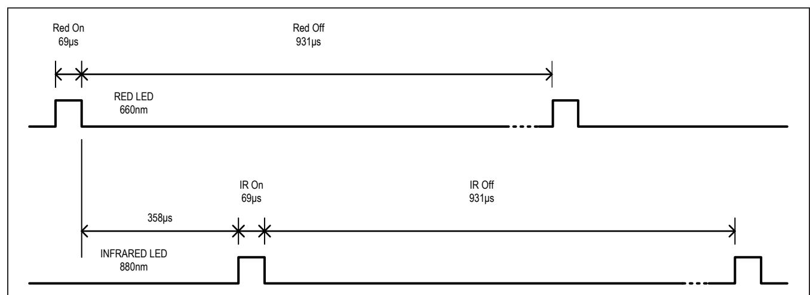

*Figure 3. Channel Slot Timing for the SpO*2 *Mode with a 1kHz Sample Rate*

| PULSE-WIDTH SETTING ( µs) | CHANNEL SLOT TIMING (TIMING PERIOD BETWEEN PULSES) (µs) | CHANNEL-CHANNEL TIMING (RISING EDGE-TO-RISING EDGE) (µs) |
|---------------------------|---------------------------------------------------------|----------------------------------------------------------|
| 69                        | 358                                                     | 427                                                      |
| 118                       | 407                                                     | 525                                                      |
| 215                       | 505                                                     | 720                                                      |
| 411                       | 696                                                     | 1107                                                     |

## **Timing in SpO2 Mode**

The internal FIFO stores up to 32 samples, so that the system processor does not need to read the data after every sample. The temperature does not need to be sampled very often–once a second or every few seconds should be sufficient.

*Figure 4. Timing for Data Acquisition and Communication When in SpO2 Mode*

**Table 15. Events Sequence for Figure 4 in SpO2 Mode**

| EVENT | DESCRIPTION                              | COMMENTS                                                                  |
|-------|------------------------------------------|---------------------------------------------------------------------------|
| 1     | Enter into SpO2 Mode. Initiate a         |                                                                           |
| 2     | Temperature Measurement Complete,        |                                                                           |
| 3     | Temp Data is Read, Interrupt Cleared     |                                                                           |
| 4     | FIFO is Almost Full, Interrupt Generated | Interrupt is generated when the FIFO almost full threshold is reached.    |
| 5     | FIFO Data is Read, Interrupt Cleared     |                                                                           |
| 6     | Next Sample is Stored                    | New Sample is stored at the new read pointer location. Effectively, it is |

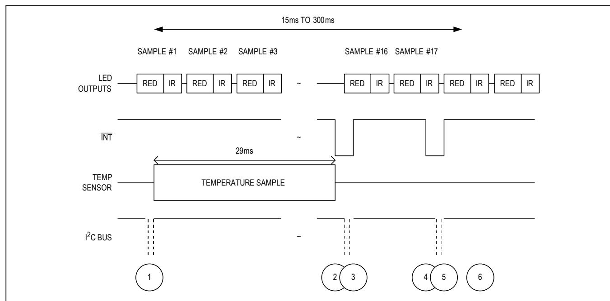

### **Timing in HR Mode**

The internal FIFO stores up to 32 samples, so that the system processor does not need to read the data after every sample. In HR mode [\(Figure 5](#page-26-0)), unlike in SpO2 mode, temperature information is not necessary to interpret the data. The user can select either the red LED or the infrared LED channel for heart rate measurements.

*Figure 5. Timing for Data Acquisition and Communication When in HR Mode*

## **Table 16. Events Sequence for Figure 5 in HR Mode**

| EVENT | DESCRIPTION                              | COMMENTS                                                                  |
|-------|------------------------------------------|---------------------------------------------------------------------------|
| 1     | Enter into Mode                          | I2C Write Command sets MODE[2:0] = 0x02. Mask the A_FULL_EN               |
| 2     | FIFO is Almost Full, Interrupt Generated | Interrupt is generated when the FIFO has only one empty space left.       |
| 3     | FIFO Data is Read, Interrupt Cleared     |                                                                           |
| 4     | Next Sample is Stored                    | New sample is stored at the new read pointer location. Effectively, it is |

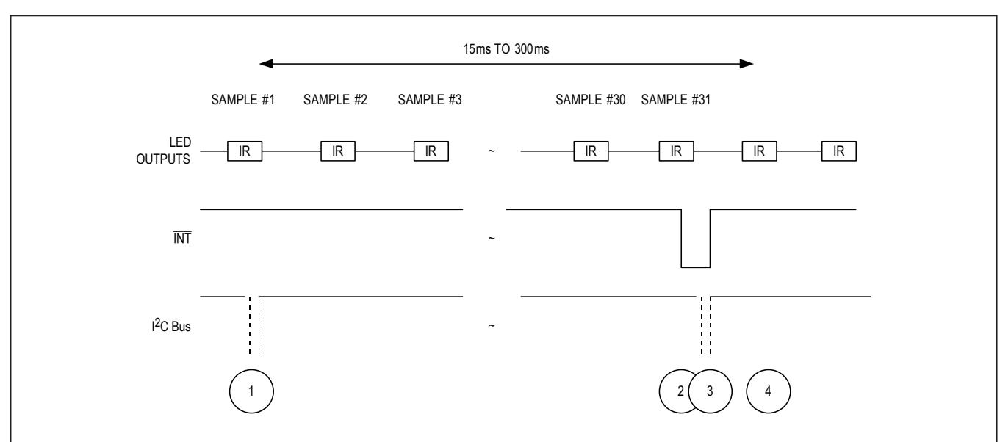

After receiving the proper slave ID, the MAX30102 issues an ACK by pulling SDA low for one clock cycle.

The MAX30102 slave ID consists of seven fixed bits, B7–B1 (set to 0b1010111). The most significant slave ID bit (B7) is transmitted first, followed by the remaining bits. Table 17 shows the possible slave IDs of the device.

### **Acknowledge**

The acknowledge bit (ACK) is a clocked 9th bit that the MAX30102 uses to handshake receipt each byte of data when in write mode (Figure 8). The MAX30102 pulls down SDA during the entire master-generated 9th clock pulse if the previous byte is successfully received. Monitoring ACK allows for detection of unsuccessful data transfers. An unsuccessful data transfer occurs if a receiving device is busy or if a system fault has occurred. In the event of an unsuccessful data transfer, the bus master retries communication. The master pulls down SDA

during the 9th clock cycle to acknowledge receipt of data when the MAX30102 is in read mode. An acknowledge is sent by the master after each read byte to allow data transfer to continue. A not-acknowledge is sent when the master reads the final byte of data from the MAX30102, followed by a STOP condition.

### **Write Data Format**

For the write operation, send the slave ID as the first byte followed by the register address byte and then one or more data bytes. The register address pointer increments automatically after each byte of data received, so for example the entire register bank can be written by at one time. Terminate the data transfer with a STOP condition. The write operation is shown in Figure 9.

The internal register address pointer increments automatically, so writing additional data bytes fill the data registers in order.

*Figure 7. START, STOP, and REPEATED START Conditions*

*Figure 8. Acknowledge*

**Table 17. Slave ID Description**

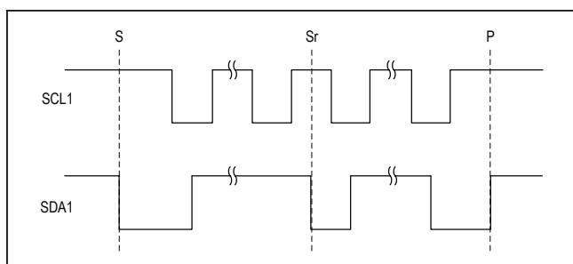

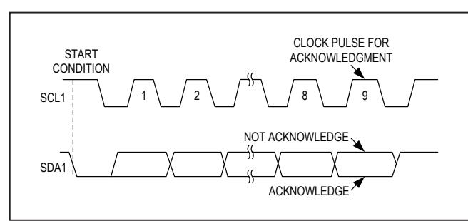

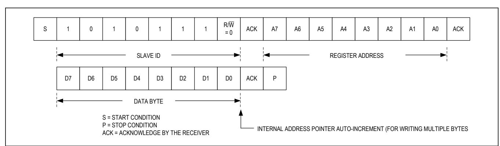

### **Read Data Format**

For the read operation, two I2C operations must be performed. First, the slave ID byte is sent followed by the I2C register that you wish to read. Then a REPEAT START (Sr) condition is sent, followed by the read slave ID. The MAX30102 then begins sending data beginning with the register selected in the first operation. The read pointer increments automatically, so the device continues sending data from additional registers in sequential order until a STOP (P) condition is received. The exception to this is the FIFO\_DATA register, at which the read pointer no longer increments when reading additional bytes. To read the next register after FIFO\_DATA, an I2C write command is necessary to change the location of the read pointer.

Figure 10 and [Figure 11](#page-29-0) show the process of reading one byte and multiple bytes of data.

An initial write operation is required to send the read register address.

Data is sent from registers in sequential order, starting from the register selected in the initial I2C write operation. If the FIFO\_DATA register is read, the read pointer will not automatically increment, and subsequent bytes of data will contain the contents of the FIFO.

*Figure 10. Reading One Byte of Data from MAX30102*

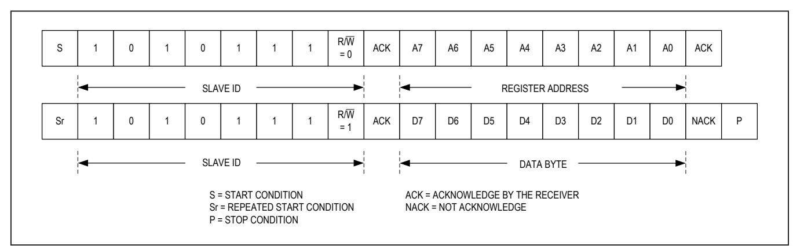

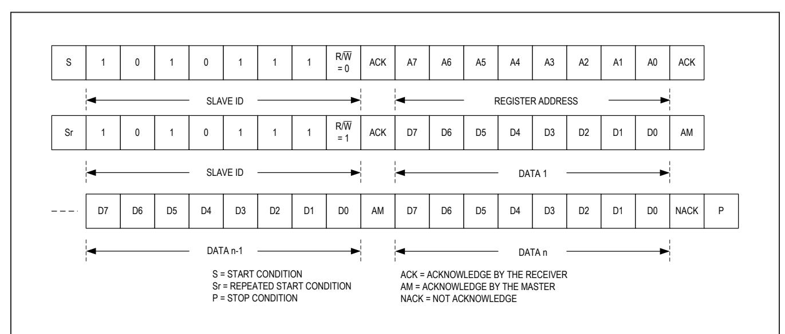

*+Denotes lead(Pb)-free/RoHS-compliant package.*

*T = Tape and reel.*

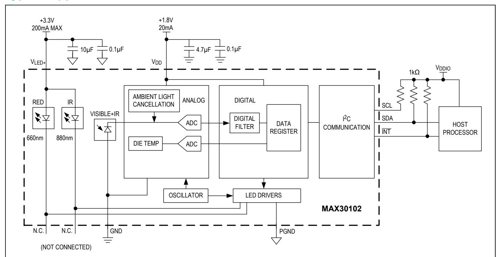

# **Typical Application Circuit**

### **Ordering Information**

| DATE                                                                        | DESCRIPTION                                                             | PAGES                   |
|-----------------------------------------------------------------------------|-------------------------------------------------------------------------|-------------------------|
| 0 9/15 Initial release                                                      |                                                                         | —                       |
| 1 10/18                                                                     |                                                                         |                         |
| Updated the                                                                 | General Description, Applications, Absolute Maximum Ratings, Electrical |                         |
| sections; updated the                                                       | System Diagram, Pin Configuration, and Functional Diagram               | ;                       |
| updated the                                                                 | Register Map , Interrupt Status (0x00–0x01), Interrupt Enable (0x02–    |                         |
| 13, Table 15, Table 16; replaced the                                        | Typical Application Circuit                                             | ; removed the Proximity |
| Function section and the Proximity Mode Interrupt Threshold (0x30) register |                                                                         |                         |

*Maxim Integrated cannot assume responsibility for use of any circuitry other than circuitry entirely embodied in a Maxim Integrated product. No circuit patent licenses are implied. Maxim Integrated reserves the right to change the circuitry and specifications without notice at any time. The parametric values (min and max limits) shown in the Electrical Characteristics table are guaranteed. Other parametric values quoted in this data sheet are provided for guidance.*

# **Revision History**

For pricing, delivery, and ordering information, please visit Maxim Integrated's online storefront at **<https://www.maximintegrated.com/en/storefront/storefront.html>**.